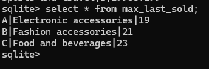

# supermarket-datapipline 

**Data profiling** - Findings and recommendations of data profiling is found at the folder data_profiling  

**Data modeling** - Data modeling has been done, and scripts for data creation are found at the folder data_modeling. Below is the ER diagram:

**Ingestion** - Data ingestion and transforming into two dim and one fact table was done using python script. Scripts are available in local_pipeline folder.

**Reporting**
Created three reporting queries with windowing function to answer below questions.

- Top 3 selling categories on each store based on sale amount (If more than one product takes any place, include all of them)

- For each product line, which store sold the most (If more than one store takes the place, include them as well)

- Which product sold as last product in each store many times

