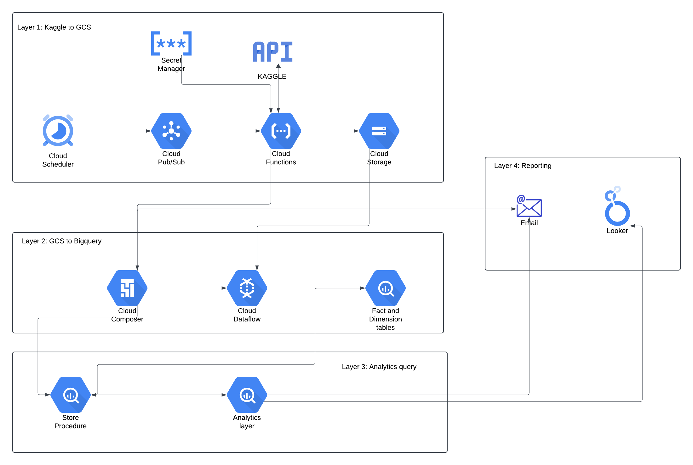
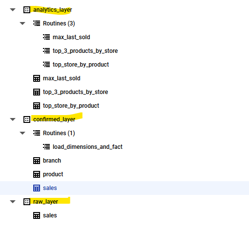
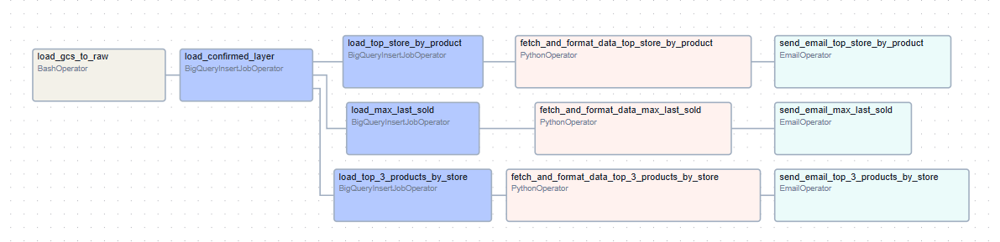

# Cloud Deployment

Cloud deployment plan: 
https://lucid.app/lucidchart/0b1364f6-69ee-46b2-bbd1-d663295aab3e/edit?viewport_loc=-347%2C-444%2C2994%2C1391%2C0_0&invitationId=inv_bb038ba2-206c-4579-babf-95e38fc83ca9

Over here in Bigquery, we have handled the data warehouse as a three layer warehouse - raw_layer,confirmed_layer, and analytics_layer.   

**raw_layer** - as is ingestion  
**confirmed_layer** - dimension and fact tables  
**analytics_layer** - reporting query result layer  

### Layer 1:
Code base for layer 1 is found in cloud_function folder. This cloud function will be triggered by cloud scheduler, and download the files into GCS bucket using Kaggle API. Once its downloaded, it will trigger the airflow DAG in layer 2.

### Layer 2:
 Layer 2 is ingestion into raw layer using dataflow orchestrated by the Airflow. Code can be found in composer&dataflow folder. Code will be loaded as is in the raw layer. Airflow DAG will orchestrate the store procedure to load the data into dimension and fact tables.

### Layer 3:

Same airflow DAG will be using store procedures to create a reporting tables in the analytics layer

### Layer 4: 

From analytics layer, airflow will read the data, and mail the report to the given user

