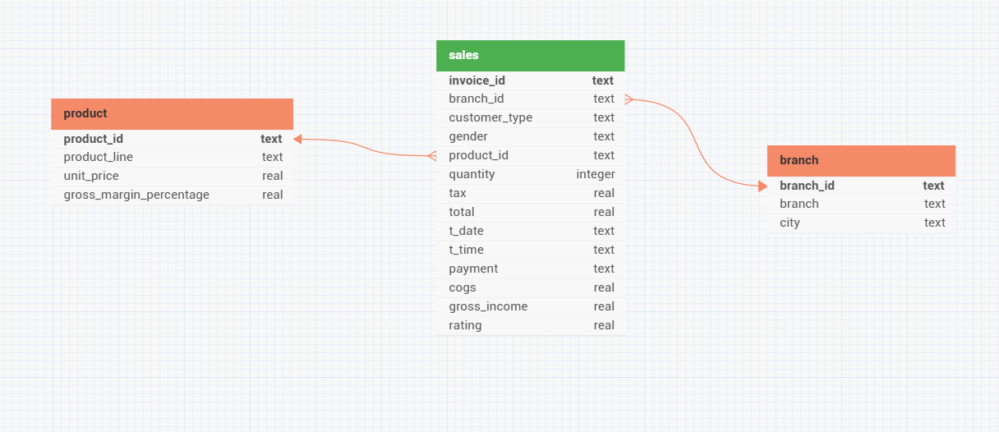

# Data Modeling

Based on the findings from the data profiling, below data model has been finialized.  
Link to data model: https://erdlab.page.link/872dmZh5YxziE8zL9

- Surrograte keys are designed to be system generated uuids
- Date and time fields are created as text due to the limitation of SQLlite datatypes
- Decimal fields are created as REAL for calculation 
- Name of the fields has been standardertized for uniformity
- date and time has been renamed to not impact the sql key words