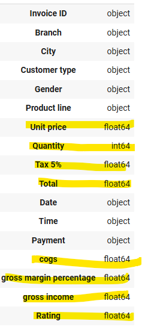

# Data Profiling

Data profiling was done using bare looks and the Ipython notebook found on this folder. Based on the findings, data modeling descisions has been made.

iPython notebook - "Data_profiling.ipynb"  
Dataset - ""supermarket_sales - Sheet1.csv"

## Datatypes:

Based on looking at the datatypes ingested by pandas, (below) given fields are only having numerical values, which we verifed further. Also description of them represents a fact about the transaction records captured. In addition, there are two other fields Date and time, which represents when this transaction has been captured, which represents the fact of the transaction. Payment also represents a fact about the transaction independently. 

**Columns**: Unit price, Quantity, Tax 5%, Total,Payment, cogs, gross margin percentage, gross income, Rating, Date,Time, Payment

This can't be the only reason to club them all to the fact table, as some of those numerical fields may represent a dimension. For example, unit price reprsents the price of a product. So, we can only consider these numerical fields as potential fields for fact table until we decide upon the dimensions.

## Dimension tables:
**Findings**:
- Based on general profiling, there are three potential dimension on this dataset - Branch, Customer, product. 
- Only two information of customer is captured namely - Customer type and Gender. They have 4 unique values. Creating them as a dimension doesn't make sense as that table won't be true representation of a customer. These four are not the only customers that made the transaction, so representing fact table with only four customers is not a true representation of data.
- There are 993 products represented here in the 1000 transaction, they can be considered as dimension. Though we can't confirm these 7 records with same product line and price as same product, for the sake fo simplicity and data availability, we will consider them as same.
- We can't confirm that unit price is same across the branches for unique product from the dataset. There may be a dynamic pricing, but due to the lack of identifier, we would consider same priced product as single product with same pricing across stores
- There are 3 branches on three cities , they are a dimension

## Additional findings:
- gross margin percentage is same for all the products, and naturally it align with the product rather than the transaction
- Ratings should generally range from 0 to 10, and it can be used for business rule validation

## Decision:
- There are two dimensions namely product and branch
- Product dimension will have Product line, Unit price, and gross margin percentage
- Branch dimension will have Branch and City
- There are no identifiers for product in dataset, so surrogate key will be used for both dimension tables
- Fact table will contain - Invoice ID, Customer type, Gender, Quantity, Tax 5%, Total, Date, Time, Payment, cogs, gross income, Rating
