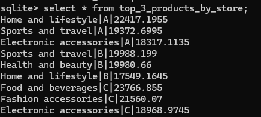
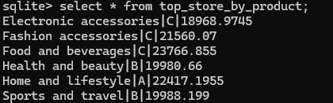
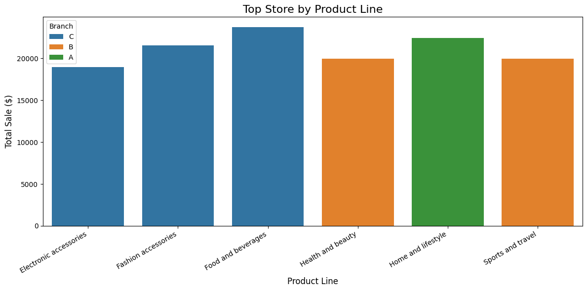

## Data ingestion and reporting 

### Data Ingestion

Pythin script - etl_ingestion_script.py

Kaggle API has been used to dowdnload the data into local

Downloaded data has been transformed into product and branch dimension, and sale fact tables.

Data has been ingested into the DB

### Reporting

 SQL Script - reporting_query.sql  
 Plot script - Plot_report.ipynb   
Created three reporting queries with windowing function to answer below questions.

- Top 3 selling categories on each store based on sale amount (If more than one product takes any place, include all of them)

- For each product line, which store sold the most (If more than one store takes the place, include them as well)

- Which product sold as last product in each store many times

